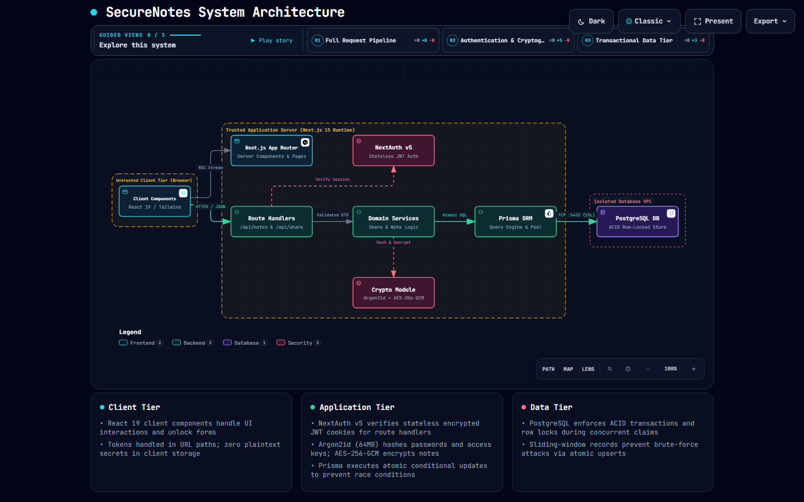
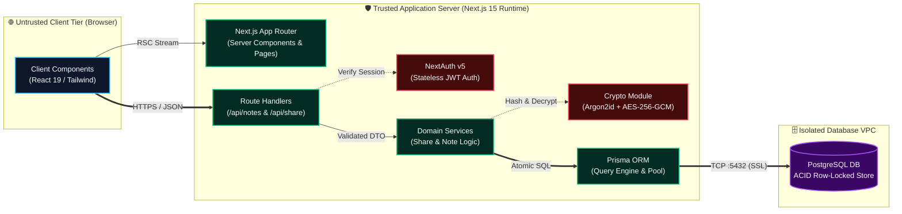
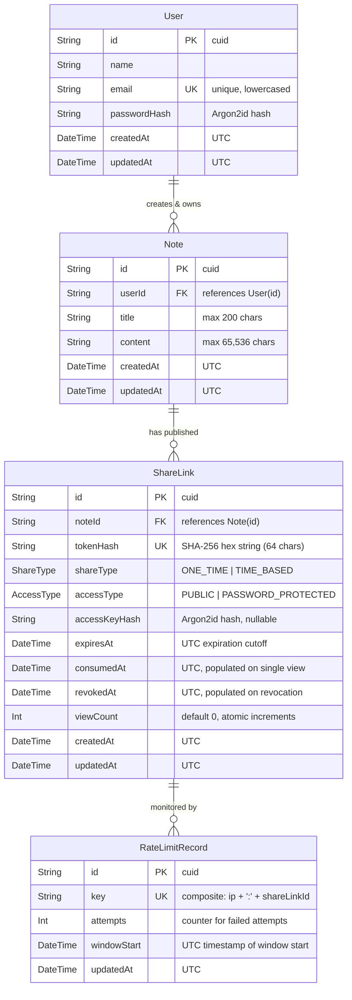

# SecureNotes: Production-Grade Secure Note-Sharing Application

[](https://secure-notes-jade.vercel.app/)
[](https://secure-notes-jade.vercel.app/architecture.html)

A production-quality, ephemeral, encrypted note-sharing platform built with **Next.js 16+ (App Router)**, **TypeScript**, **PostgreSQL**, **Prisma ORM**, and **Auth.js v5**. Designed from the ground up with a focus on transactional correctness, zero race conditions, cryptographically secure token management, memory-hard credential hashing, and horizontal scalability.

- **🚀 Live Deployed Application**: [https://secure-notes-jade.vercel.app/](https://secure-notes-jade.vercel.app/)
- **🏛️ Live Interactive Architecture**: [https://secure-notes-jade.vercel.app/architecture.html](https://secure-notes-jade.vercel.app/architecture.html)

---

## 1. Project Overview

SecureNotes enables authenticated users to create and distribute confidential notes (passwords, credentials, private memos) under strict security and lifecycle constraints:
- **One-Time Self-Destructing Notes**: Guaranteed atomic consumption where exactly one recipient can view the content, even under intense concurrent access.
- **Time-Based Notes**: Accessible repeatedly until a strict server-enforced UTC expiration timestamp is reached.
- **Password Protection**: Server-generated, dynamic, human-friendly access keys (e.g., `K8F4-X92M`) hashed with Argon2id at rest.
- **Brute-Force Defense**: Distributed sliding-window rate limiting keyed by IP and share link.
- **Zero Plaintext Secrets at Rest**: Share tokens are hashed with SHA-256 before database insertion; access keys and passwords use Argon2id.

---

## 2. System Architecture & Trust Boundaries

The system is organized into three distinct security and operational tiers with explicit trust boundaries:

[](https://secure-notes-jade.vercel.app/architecture.html)

> 💡 **Live Interactive Architecture Viewer**: Explore the standalone diagram directly at **[https://secure-notes-jade.vercel.app/architecture.html](https://secure-notes-jade.vercel.app/architecture.html)** to interact with the full Archify viewer featuring dark/light themes, component isolation, pan/zoom, and curated request stories.

### Architecture Topology & Trust Boundaries



### Layer Responsibilities

- **Client Components (`src/components/`)**: Handle UI state, forms, client-side input masking, and unlock challenges. Zero secret tokens or unencrypted payloads are persisted in client storage (`localStorage` / `sessionStorage`).
- **Route Handlers (`src/app/api/`)**: Pure HTTP controllers performing Zod schema validation, cookie parsing, and standard JSON envelope serialization (`apiSuccess`, `apiError`).
- **Authentication Layer (`src/lib/auth/`)**: NextAuth v5 stateless session provider verifying signed, encrypted JWT session cookies on protected endpoints.
- **Domain Services (`src/server/services/`)**: Pure business logic orchestrators (`NoteService`, `ShareService`, `RateLimitService`) enforcing atomic operations, sliding-window rate limits, and zero-race-condition constraints.
- **Cryptography Engine (`src/lib/security/`)**: Performs memory-hard Argon2id key hashing (64MB RAM, 3 iterations), authenticated AES-256-GCM payload encryption with unique IVs, and SHA-256 token hashing at rest.
- **Prisma Client (`src/lib/db/prisma.ts`)**: Manages the PostgreSQL connection pool and executes parameterized atomic SQL queries (`UPDATE ... WHERE "consumedAt" IS NULL`).
- **PostgreSQL Database**: Authoritative state store providing ACID transactional guarantees and row-level locking for atomic single-recipient claims.

---

## 3. Technology Stack

| Layer | Technology | Rationale |
|---|---|---|
| **Framework** | Next.js 16+ (App Router) | Server-first architecture, React Server Components by default, Route Handlers. |
| **Language** | TypeScript (Strict Mode) | Full compile-time type safety across client, server, and database models. |
| **Database** | PostgreSQL | Authoritative ACID transactions, row-level locking, and high-performance B-tree indexing. |
| **ORM** | Prisma 6.x | Schema-driven migrations, type-safe queries, and raw parameterized SQL execution. |
| **Authentication** | Auth.js v5 (NextAuth) | Stateless, signed, and encrypted JWT session cookies for horizontal scaling. |
| **Validation** | Zod | Strict runtime schema validation for all external API inputs. |
| **Cryptography** | Node.js `crypto` & `@node-rs/argon2` | CSPRNG tokens, SHA-256 token hashing at rest, and memory-hard Argon2id password/key hashing. |
| **Styling** | Tailwind CSS | Fast, accessible, dark-themed responsive UI. |
| **Testing** | Vitest | Fast unit, integration, concurrency, and end-to-end test execution. |

---

## 4. Database Design & Schema

The relational schema is defined in [`prisma/schema.prisma`](file:///c:/Users/atul7/OneDrive/Desktop/my-work/peacock%20india/prisma/schema.prisma):



### Strategic Indexing Decisions:
- `ShareLink(tokenHash)`: **Unique B-tree index**. The primary public lookup path for `/share/[token]` executes in $O(1)$ time.
- `ShareLink(noteId)`: Foreign key index enabling instant joins when loading an owner's note management view.
- `ShareLink(expiresAt, revokedAt)`: Composite index for fast expiration and revocation status filtering.
- `Note(userId)`: Index on foreign key for high-speed dashboard listings.
- `User(email)`: Unique index enforcing email uniqueness and optimizing credential lookups.
- `RateLimitRecord(key)`: Unique index on the composite `ip:shareLinkId` key for instant rate-limit counter checks.

---

## 5. Security & Share-Link Flow

### 1. Token Generation & Storage
```text
CSPRNG (crypto.randomBytes(32))
            ↓
rawToken (Base64URL, 43 characters, 256 bits entropy)
            ↓
SHA-256 Cryptographic Hash
            ↓
tokenHash (64-character hex string)
            ↓
Stored in PostgreSQL with UNIQUE index
```
- The raw token is included in the URL (`/share/<rawToken>`) and returned **only once** to the creator.
- **Defense in Depth**: If the PostgreSQL database or a backup is leaked, an attacker cannot reverse SHA-256 hashes to obtain active raw share links.

### 2. Dynamic Access Key Generation
For password-protected notes:
```text
CSPRNG (crypto.randomInt)
            ↓
rawKey (8-char unambiguous alphanumeric: e.g. K8F4-X92M, ~40 bits entropy)
            ↓
Display once to creator on note creation
            ↓
Argon2id Memory-Hard Hash (64MB memory, 3 passes, 1 thread)
            ↓
Stored as accessKeyHash in PostgreSQL
```
- Raw access keys are **never stored**, **never logged**, and **never returned** in subsequent database queries.

---

## 6. Server-Side Expiration (UTC)

Expiration is strictly evaluated on the server using authoritative UTC timestamps:
```sql
expiresAt > (NOW() AT TIME ZONE 'UTC')
```
- A link is valid only when `expiresAt > currentServerUtcTime`.
- When `expiresAt <= currentServerUtcTime`, the link is immediately considered expired.
- Expired links **never reveal note content** and **never increment view counts**.

---

## 7. Revocation Logic

The note owner can revoke any active share link from `/notes/[id]`:
- Setting `revokedAt = (NOW() AT TIME ZONE 'UTC')` permanently deactivates the link.
- Authorization is strictly enforced server-side (`note.userId === session.user.id`); unauthorized attempts return `403 Forbidden`.
- Revoked links are immediately rejected on future access, cannot accept access keys, and never increment view counts.

---

## 8. View Count Accounting Matrix

View counts are incremented atomically and reflect **only verified, successful disclosures**:

| Event / Scenario | View Count Change | State Change |
|---|:---:|---|
| Successful public view | **+1** | If `ONE_TIME`: `consumedAt = NOW()` |
| Successful password unlock | **+1** | If `ONE_TIME`: `consumedAt = NOW()` |
| Incorrect access key attempt | **+0** | Failed attempt recorded; not consumed |
| Invalid / Malformed token | **+0** | Uniform 404 response |
| Expired link access | **+0** | Uniform 404 response |
| Revoked link access | **+0** | Uniform 404 response |
| Already-consumed one-time link | **+0** | Uniform 404 response |
| Rate-limited request (HTTP 429) | **+0** | Request rejected |

---

## 9. Comprehensive Answers to Technical Questions

### Question 1: How do you prevent two users from using a one-time link at the same time?

#### The Flaw of Read-Modify-Write
In naive implementations:
```ts
// ❌ RACE CONDITION VULNERABILITY
const link = await prisma.shareLink.findUnique({ where: { tokenHash } });
if (!link.consumedAt) {
  // Concurrent Request B also passes this check before Request A updates!
  await prisma.shareLink.update({
    where: { id: link.id },
    data: { consumedAt: new Date() },
  });
}
```
Under concurrent traffic (e.g. 20 simultaneous requests), both requests read `consumedAt == null` before either commits the write, resulting in multiple viewers reading the confidential secret.

#### The Atomic Solution
We implement an **atomic conditional SQL update** with row-level locking directly in the PostgreSQL engine:
```sql
UPDATE "ShareLink"
SET "consumedAt" = (NOW() AT TIME ZONE 'UTC'),
    "viewCount" = "viewCount" + 1,
    "updatedAt" = (NOW() AT TIME ZONE 'UTC')
WHERE "id" = $1
  AND "consumedAt" IS NULL
  AND "revokedAt" IS NULL
  AND "expiresAt" > (NOW() AT TIME ZONE 'UTC')
RETURNING "id";
```

#### How PostgreSQL Guarantees Mutual Exclusion:
1. When multiple transactions attempt to update the same row concurrently, PostgreSQL acquires an **exclusive row-level write lock** (`FOR UPDATE`) on the target row for the first transaction that reaches the execution engine.
2. The remaining 19 transactions are blocked, waiting for the first transaction to complete.
3. Transaction 1 executes, modifies `consumedAt`, commits, and releases the lock.
4. When the remaining 19 transactions re-evaluate the `WHERE` predicate on the newly updated row, the condition `"consumedAt" IS NULL` evaluates to `FALSE`.
5. Exactly **1 transaction** updates the row and receives 1 affected row. The other 19 transactions update 0 rows.
6. The application checks the affected row count: if `0`, it immediately returns a uniform unavailable response (`404 Not Found`).

This guarantee is proven in our automated test suite ([`tests/integration/concurrency.test.ts`](file:///c:/Users/atul7/OneDrive/Desktop/my-work/peacock%20india/tests/integration/concurrency.test.ts)): 20 concurrent requests fire simultaneously against a single one-time link, resulting in exactly **1 success, 19 failures, and `viewCount == 1`**.

---

### Question 2: How do you update view count safely?

#### The Problem with Read-Modify-Write
Writing `link.viewCount = link.viewCount + 1` in application code causes lost updates:
```text
Thread A: Reads viewCount = 5
Thread B: Reads viewCount = 5
Thread A: Writes viewCount = 6
Thread B: Writes viewCount = 6 (Lost increment! Correct count should be 7)
```

#### The Atomic Solution
We execute atomic database increments:
- For time-based links:
  ```ts
  await prisma.shareLink.update({
    where: { id: link.id },
    data: {
      viewCount: {
        increment: 1,
      },
    },
  });
  ```
  PostgreSQL compiles this to `SET "viewCount" = "viewCount" + 1`, which evaluates atomically inside the row lock.
- For one-time links: The increment is bundled into the single atomic conditional consumption query (`SET "consumedAt" = NOW(), "viewCount" = "viewCount" + 1`), ensuring that only the transaction that claims consumption can increment the view counter.

---

### Question 3: How would this work if 1 million people opened the link?

Designing for 1,000,000 users requires separating static delivery from authoritative transactional state:

```text
                           1,000,000 Requests
                                   │
                                   ▼
                      Edge CDN (Cloudflare / CloudFront)
                       • Caches UI assets, JS, CSS
                       • Drops invalid HTTP requests
                       • Edge DDoS mitigation
                                   │
                                   ▼
                            Load Balancer
                                   │
             ┌─────────────────────┼─────────────────────┐
             ▼                     ▼                     ▼
      Next.js Node #1       Next.js Node #2       Next.js Node #N
     (Stateless Worker)    (Stateless Worker)    (Stateless Worker)
             │                     │                     │
             └─────────────────────┼─────────────────────┘
                                   │ Connection Pooler
                                   ▼
                       PgBouncer / Transaction Pooler
                                   │ Max 100-200 open connections
                                   ▼
                       Primary PostgreSQL Cluster
                        • Master: Authoritative writes & locks
                        • Read Replicas: Time-based public reads
```

1. **Stateless Application Servers**:
   Next.js Route Handlers maintain zero in-memory session or share state. Auth.js sessions are verified via cryptographically signed JWT cookies. Any server instance behind the load balancer can process any request.
2. **PostgreSQL as the Single Source of Truth**:
   Critical state (`consumedAt`, `revokedAt`, `expiresAt`, `viewCount`) lives exclusively in PostgreSQL to ensure transactional consistency across all instances.
3. **Connection Pooling**:
   Directly connecting 1,000,000 concurrent client requests to PostgreSQL would exhaust process memory and connection limits. We place **PgBouncer** (or Supabase Transaction Pooler) in front of PostgreSQL, multiplexing tens of thousands of application requests over a lean pool of ~100 direct database connections.
4. **Targeted B-Tree Indexing**:
   Incoming tokens are hashed via SHA-256 and matched against the unique B-tree index on `ShareLink.tokenHash`. Lookups execute in $O(\log N)$ (effectively $O(1)$ with index pages in RAM buffer cache), avoiding sequential scans.
5. **Read Replicas & Caching Strategy**:
   - Dynamic `/api/share/*` responses are configured with `Cache-Control: no-store` so proxies and CDNs never serve stale authorizations or bypass view counters.
   - For heavily trafficked time-based public links, read traffic can be directed to PostgreSQL Read Replicas, leaving the Primary dedicated to writes and atomic row locks.

---

### Question 4: How would you prevent brute-force attempts on password-protected links?

Brute-force defense is implemented through multiple defense-in-depth mechanisms:

1. **Distributed Sliding-Window Rate Limiting**:
   We track failed attempts in PostgreSQL using a composite key: `ip_address:share_link_id`.
   - **Policy**: Maximum 5 failed attempts per 15-minute sliding window.
   - **Response**: The 6th attempt immediately returns **HTTP 429 (Too Many Requests)** with a `Retry-After: 900` header, and the frontend displays a live countdown timer.
   - **Scope**: Keying on `IP + ShareLink` ensures that an attacker targeting one link cannot lock out other legitimate users or cause a denial-of-service across the platform.
2. **Memory-Hard Password Hashing (Argon2id)**:
   Access keys are hashed with Argon2id using OWASP-recommended parameters (64MB memory, 3 iterations, 1 parallelism). The high memory requirement prevents attackers from deploying GPU or ASIC hardware clusters to perform offline dictionary attacks if the database is ever compromised.
3. **Timing-Attack Resistance**:
   Token lookup and key comparison execute in constant-time hash evaluations, preventing attackers from deducing character matches via response latency.
4. **Uniform Generic Responses**:
   The API returns uniform error messages (`"Invalid access key."` or `"This share link is unavailable."`) regardless of whether the token exists, is expired, or is revoked, preventing share token enumeration.

---

## 10. Local Setup & Quickstart

### Prerequisites
- Node.js v20.x or higher
- PostgreSQL running locally or via Docker on port 5432
- npm v10+

### Installation & Initialization
```bash
# 1. Clone repository and install dependencies
npm install

# 2. Configure environment variables (.env)
cp .env.example .env

# 3. Synchronize database schema and generate Prisma client
npx prisma generate
npx prisma db push

# 4. Start development server
npm run dev
```

Application will be running at `http://localhost:3000`.

---

## 11. Automated Test Suite

Run the full automated test suite (including unit, integration, and mandatory concurrency tests):

```bash
# Run all tests via Vitest
npm test

# Run the mandatory 20-concurrent-requests race condition test
npx vitest run tests/integration/concurrency.test.ts
```

### Verified Test Coverage:
- **Unit Tests**: Token CSPRNG entropy, Base64URL encoding, SHA-256 deterministic hashing, Argon2id password verification, dynamic access key formatting.
- **Integration Tests**:
  - `public-share.test.ts`: Public note access, atomic view increments, UTC expiry enforcement.
  - `concurrency.test.ts`: 20 concurrent requests against a one-time link $\rightarrow$ exactly 1 winner, 19 losers, 1 view count increment.
  - `password-share.test.ts`: Challenge prompt, wrong key rejection, zero view count on failure, 5-attempt rate-limit lockout (HTTP 429).
  - `note-management.test.ts`: Owner isolation, 403 Forbidden for non-owners, instant link revocation.
  - `auth.test.ts`: Registration, duplicate email rejection, credential authentication.
- **E2E Tests**: `share-flow.spec.ts` covering the complete user lifecycle from registration to revocation.

---

## 12. Project Structure

```text
├── src/
│   ├── app/
│   │   ├── page.tsx                     # Landing & overview
│   │   ├── login/page.tsx               # Login page
│   │   ├── register/page.tsx            # Registration page
│   │   ├── notes/
│   │   │   ├── page.tsx                 # Owner notes dashboard
│   │   │   ├── new/page.tsx             # Create note form
│   │   │   └── [id]/page.tsx            # Note management & revocation
│   │   ├── share/
│   │   │   └── [token]/page.tsx         # Public & protected share viewer
│   │   └── api/
│   │       ├── auth/[...nextauth]/      # Auth.js handlers
│   │       ├── register/                # Registration endpoint
│   │       ├── notes/                   # Note creation & listing
│   │       └── share/[token]/           # Share resolution, unlock & revoke
│   ├── components/
│   │   ├── ui/                          # Button, Input, Card, Alert
│   │   ├── layout/                      # Navbar
│   │   ├── auth/                        # LoginForm, RegisterForm
│   │   ├── notes/                       # NoteForm, NoteList, NoteDetail
│   │   └── share/                       # UnlockForm, NoteViewer
│   ├── lib/
│   │   ├── auth/auth.ts                 # Auth.js v5 credentials configuration
│   │   ├── db/prisma.ts                 # Prisma Client singleton
│   │   ├── security/                    # Tokens, Argon2id hashing, Access keys
│   │   └── validation/                  # Zod schemas (auth, note, share)
│   ├── server/services/
│   │   ├── auth.service.ts              # Registration & credentials service
│   │   ├── note.service.ts              # Note management & revocation service
│   │   ├── share.service.ts             # Atomic claim & unlock service
│   │   └── rate-limit.service.ts        # PostgreSQL sliding-window limiter
│   └── middleware.ts                    # Edge-compatible session cookie guard
├── prisma/
│   └── schema.prisma                    # PostgreSQL schema definition
└── tests/
    ├── unit/                            # Cryptographic & token tests
    ├── integration/                     # Concurrency, public, password, auth tests
    └── e2e/                             # End-to-end user journey tests
```
